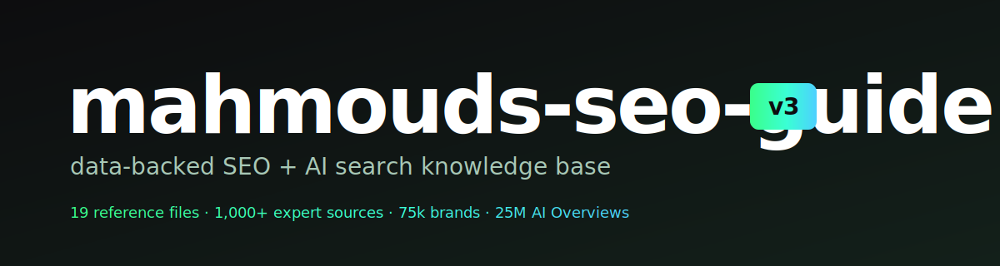

<p align="center">
  
</p>

<p align="center">
  <a href="https://github.com/MahmoudHalat/mahmouds-seo-guide-v3/releases/latest"></a>
  <a href="https://github.com/MahmoudHalat/mahmouds-seo-guide-v3/blob/main/LICENSE"></a>
  <a href="#install"></a>
  <a href="#whats-inside"></a>
  <a href="#sources"></a>
</p>

---

**mahmouds-seo-guide-v3** is a Claude Code skill that turns Claude into an SEO operator instead of a generic chatbot pulling from random Twitter threads.

Search broke into pieces. Google still matters but ChatGPT, Perplexity, Claude, and Google's own AI Overviews now answer queries that used to send traffic to your site. The old playbook (write a blog, build links, wait) doesn't cover any of it. Most SEO guides on the internet are written for one platform and dated by the time you read them.

This one isn't. Nineteen reference files distilled from 1,000+ expert sources, including audits of 75k+ brands, 25M+ AI Overviews, and 17M+ citations across seven AI platforms. Covers traditional SEO, AI search visibility (AEO/GEO), keyword research, technical SEO, content strategy, conversion copy, customer research, competitor research, and the psychology of why people click.

The skill loads on demand. You ask Claude to draft a brief or audit a page, it routes to the 1-2 reference files that apply, and the answer comes back grounded in numbers instead of vibes.

## Why I built this

To rank my own websites better. To rank my clients' websites better. To stop opening 30 browser tabs every time I needed to remember the right schema priority or check the current state of GEO citation patterns.

Most SEO guides online are old (pre-AI search), narrow (Google-only), or theoretical (frameworks without numbers). I needed one source of truth I could load into a coding agent and actually use to ship work. Keyword briefs, content audits, technical SEO checks, GEO optimization, the whole pipeline.

So I built it. Started as one big markdown file, broke into 19 routed reference files when the agent context started choking. Every claim cites its source. Every framework has numbers behind it. Product-agnostic, which means it works the same whether you're ranking a SaaS landing page, an e-commerce category, a creator newsletter, or a B2B sales site.

I run this against my own work and my clients' work daily. If someone uses it to rank their own stuff, that's the point.

## Why I keep updating it

Search changes faster than any guide. v3 added customer research and competitor research playbooks, marketing psychology, GA4 implementation, hreflang and URL pattern guidance, AI-bot robots.txt rules, llms.txt and pricing.md emerging standards, and rebuilt conversion copy. v2 added the AEO/GEO playbook. v1 was just SEO basics.

The next version will probably add more on AI search citation gaming, Reddit-as-distribution, and whatever Google ships in the next algorithm update. Expect a lot of changes.

## Sponsors

<a href="https://givefeedback.dev"></a>GiveFeedback.dev uses AI to turn client screen recordings into clear tasks and stop scope creep.

## Install

One command. The skill drops into your Claude Code skills folder and wakes up when you say things like *"keyword research for X"*, *"audit this page"*, *"draft a brief"*, *"how do I rank in AI Overviews"*, *"what's wrong with my SEO"*.

```bash
curl -L https://github.com/MahmoudHalat/mahmouds-seo-guide-v3/releases/latest/download/mahmouds-seo-guide-v3.skill -o /tmp/seo-guide.zip \
  && unzip -o /tmp/seo-guide.zip -d ~/.claude/skills/ \
  && rm /tmp/seo-guide.zip
```

The skill lands at `~/.claude/skills/mahmouds-seo-guide-v3/`. Restart Claude Code and it loads.

Want git? Clone right in:

```bash
git clone https://github.com/MahmoudHalat/mahmouds-seo-guide-v3.git ~/.claude/skills/mahmouds-seo-guide-v3
```

## Use

In Claude Code, just talk to it:

```
write me a content brief for "AI productivity tools"
audit this landing page for AI search visibility
what's the right schema for a SaaS pricing page?
how do I rank a comparison page in 2026?
my traffic dropped 30% last month, what do I check first?
keyword research for a B2B fintech blog
draft a competitor teardown for [Competitor X]
build a 30-day SEO plan for a new SaaS
```

Claude routes to the right reference file (or two) and answers from there. You don't need to know which file applies. The router is in [SKILL.md](SKILL.md).

## What's inside

Nineteen reference files in `references/`. Each is loaded on demand based on the task. The router from [SKILL.md](SKILL.md):

| Intent | File | Keywords |
|---|---|---|
| AI search visibility | `aeo-geo-playbook.md` | AEO, GEO, ChatGPT, Perplexity, AI Overviews, llms.txt |
| Keyword research | `keyword-research.md` | keywords, volume, difficulty, topic ideas |
| On-page SEO | `on-page-seo.md` | title, meta, E-E-A-T, headings, internal links |
| Technical SEO | `technical-seo.md` | schema, speed, crawling, indexing, robots.txt, hreflang, AI bots |
| Content strategy | `content-strategy.md` | calendar, clusters, what to publish, funnel |
| Writing | `content-writing.md` | blog, landing page, draft, CTA, headlines, conversion copy |
| AI-assisted content | `ai-content-workflows.md` | AI writing, automate SEO |
| Link building | `link-building.md` | backlinks, outreach, digital PR, DA |
| Brand for AI | `brand-building-ai.md` | brand mentions, YouTube SEO, entity |
| Distribution | `distribution-reddit.md` | Reddit, social, email, cross-platform |
| Analytics | `analytics-measurement.md` | GSC, KPIs, GA4, UTM, events, tracking plan |
| Algorithm updates | `algorithm-resilience.md` | traffic drop, Google update, recovery |
| Local SEO | `local-seo.md` | GBP, Maps, "near me", service area |
| Monetization | `monetization-creator-seo.md` | revenue, affiliate, agency, freelance |
| Audit checklists | `checklists.md` | audit, review, check |
| Fundamentals | `seo-fundamentals.md` | what is SEO, myths, maturity |
| Customer research | `customer-research-playbook.md` | VOC, JTBD, transcripts, personas |
| Competitor research | `competitor-research-playbook.md` | competitive intel, profile, battle card, teardown |
| Psychology | `psychology-mental-models.md` | bias, persuasion, mental models, why people buy |

Three files are new in v3 (customer research, competitor research, psychology). Several others were heavily updated for the AI-search shift.

## Quick reference

A handful of frameworks the skill uses constantly:

- **BID Test (keyword filter):** Business potential (1-3) + Intent verification + Difficulty
- **Opportunity Score:** `(Volume × Intent Weight) / Difficulty`. Intent weights: Info=1, Nav=1, Commercial=2, Transactional=3
- **Top 5 GEO Factors:** Brand mentions > Long-tail coverage > Structure > Freshness (cited content is 25.7% fresher) > Platform diversification (86% of cited URLs are unique to one platform)
- **Schema Priority:** P0 (Organization, Breadcrumb, WebSite) > P1 (Article, FAQ, HowTo) > P2 (Product, Review) > P3 (Person, SameAs)
- **Three-Bucket Model:** AI brand visibility + traditional SEO for action queries + owned audience
- **Content Quality formula:** Intent 20% + E-E-A-T 20% + Depth 20% + On-Page 15% + UX 15% + Technical 10%
- **"Last Click" test:** Would the reader need to search again after reading? If yes, the page isn't done.
- **CTA formula:** `[Action Verb] + [What They Get] + [Qualifier]`
- **So-What test:** `Feature → which means... → Benefit → so you can... → Outcome`
- **Research confidence bar:** High = 5+ sources across 2+ source types. Only High goes on the homepage.

The full version of each lives in the relevant reference file.

## Sources

The catalog is distilled from **1,000+ expert sources**, including:

- Audits of 75k+ brands across SEO, AEO, and GEO contexts
- Analysis of 25M+ AI Overviews
- 17M+ citations tracked across 7 AI platforms (ChatGPT, Perplexity, Claude, Gemini, Google AI Overviews, Bing Copilot, plus enterprise variants)
- Practitioner literature: Aleyda Solis, Lily Ray, Marie Haynes, Glen Allsopp, Mark Williams-Cook, Cyrus Shepard, Alan Bleiweiss, Tom Capper, Andrew Holland, the entire SEO Twitter/X community, Search Engine Land, Search Engine Journal
- Vendor research: Ahrefs, Semrush, Sistrix, BrightEdge, Conductor, Botify, Lumar, Rank Ranger
- AI-search vendors: Profound, Bluefish, Otterly, Goodie AI, Writesonic GEO
- Academic and industry papers on retrieval-augmented generation, query fanout, and citation mechanics

Every numerical claim in a reference file is sourced. The full citation pattern is "claim, source name, date" inline in each `references/*.md` file.

## What it doesn't do

It's a knowledge base, not a tool. It doesn't crawl your site, run audits automatically, or ping APIs. It loads into a Claude Code session and answers from the references when you ask SEO/AEO/GEO questions.

It also doesn't replace doing the work. The frameworks tell you *what* to look for. Actually shipping content, fixing technical issues, and earning links is still on you.

## Composing with other skills

This guide pairs with three other skills in the family:

- **mahmouds-seo-writer**: autonomous SEO content writer that calls into this guide for the structural rules
- **mahmouds-reddit-strategist**: Reddit drafting and recon, uses the distribution-reddit reference
- **[slop-cop](https://github.com/MahmoudHalat/slop-cop)**: final voice and comprehension audit before any content ships

The writer drafts, the strategist publishes, the slop-cop checks. This guide is the thinking layer underneath.

## License

MIT. Use it. Fork it. Ship a fork with sharper takes than mine. The catalog will need updates as Google ships new AI features and the AEO/GEO landscape shifts. PRs welcome for new patterns, new vendor data, new platform research.
